# 🐾 Projeto Yummy

- **Autores:** Ester Maria e Mateus Brito
- **Baseado em:** [Automatic Arduino Powered Pet Feeder](https://www.instructables.com/Automatic-Arduino-Powered-Pet-Feeder/)
- **Data:** 2025-12-17

---

## Sumário
- [Contextualização](#contextualização)
- [Guia do Usuário](#guia-do-usuario)
- [Código e Bibliotecas](#código-e-bibliotecas)
- [Lista de Materiais](#lista-de-materiais)
- [Diagrama da Montagem (Fritzing)](#diagrama-da-montagem-fritzing)
- [Explicação do Diagrama](#explicação-do-diagrama)
- [Foto do Projeto Montado](#foto-do-projeto-montado)
- [Vídeo do Projeto em Funcionamento](#vídeo-do-projeto-em-funcionamento)
- [Problemas Encontrados](#problemas-encontrados)
- [Evolução do Projeto](#evolução-do-projeto)
- [Referências](#referências)
- [Créditos](#créditos)

---

## Contextualização
O **Projeto Yummy** consiste no desenvolvimento de um alimentador automático de pets, utilizando a plataforma Arduino, com foco em automação, controle de quantidade de ração e interação do usuário via interface web.

A motivação do projeto surge da necessidade de garantir que animais de estimação recebam a quantidade correta de alimento, mesmo na ausência do dono, evitando tanto a subalimentação quanto o excesso de ração. Para isso, o sistema combina atuadores mecânicos, sensor de peso (balança) e conectividade Wi-Fi, permitindo um controle mais preciso e automatizado do processo.

Diferentemente de alimentadores baseados apenas em tempo, o Yummy utiliza uma balança calibrada para medir a quantidade real de ração servida. Dessa forma, o processo de liberação só é finalizado quando o peso configurado pelo usuário é atingido, aumentando a confiabilidade do sistema.

---

## Guia do Usuário
Essa seção descreve como o usuário interage com o alimentador automático por meio do navegador.

### Inicialização do Sistema
- Conecte o Arduíno à fonte de alimentação.
- Aguarde alguns segundos para que o módulo Wi-fi inicializa corretamente.

### Acesso à Interface Web
- O dispositivo deve estar conectado à mesma rede configurada no código .ino (por padrão, o código está conectado à rede da UFSJ).
- Abra um navegador de internet
- Digite o endereço "172.18.191.210" na barra de navegação.
- Ao acessar o endereço, a página de controle do alimentador será exibida.

### Configuração da Quantidade de Ração
- Na interface web, o usuário pode configurar a quantidade de ração desejada, em quilogramas.
- O valor padrão configurado no sistema é 0.06 kg.

### Servir a Ração
- Após definida a quantidade desejada, pressione o botão "Iniciar" na interface.
- O servo agitador começa a movimentar a reção no reservatório.
- Em seguida, o motor responsável pela liberação da ração é acionado.
- A ração é liberada gradualmente.
- A balança monitora o peso em tempo real.
- O sistema interrompe automaticamente a liberação quando o peso configurado é atingido.

### Finalização do Processo
- Ao atingir o peso desejado os motores são desligados e o processo de alimentação é encerrado.
- O sistema fica pronto para uma nova configuração ou novo acionamento.

---

## Códigos e Bibliotecas

### Código principal utilizado
Arquivo principal: 'codigo.ino'

### Bibliotecas (não-padrão)
- **HX711** (`HX711.h`) — *Bogdan Necula*  
  - Via Library Manager: buscar por `HX711`  

- **Servo** — geralmente já disponível na IDE do Arduino (padrão).

### Observações sobre compilação
- Plataforma alvo: **Arduino Uno**
- Antes de compilar, verifique se a biblioteca `HX711` está instalada; caso contrário, instale via **Sketch → Include Library → Manage Libraries**.

---

## Materiais

### 🔌 Componentes 
- **1x** Servo motor (utilizado no projeto: SG90)
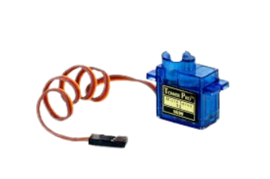  
- **1x** Micro Motor DC N20 
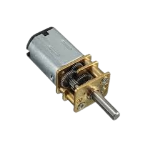  
- **1x** Peça impressa em 3D para movimentação da ração
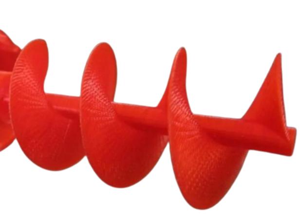
- **1x** Peça impressa em 3D para agitar a ração
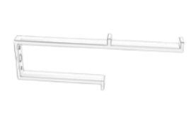
- **1x** Tubo de PVC em T de **1 ½"**  
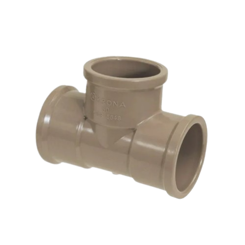
- **1x** Arduino Mega  
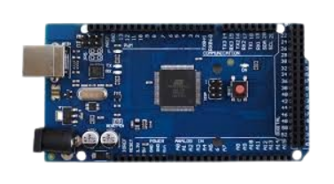
- **1x** Módulo Wi-Fi ESP8266
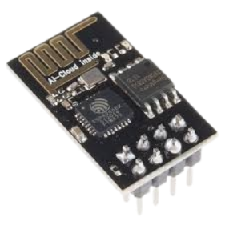
- **1x** Placa HX711
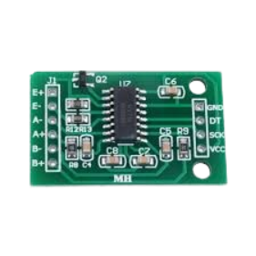
- **1x** Módulo Ponte H
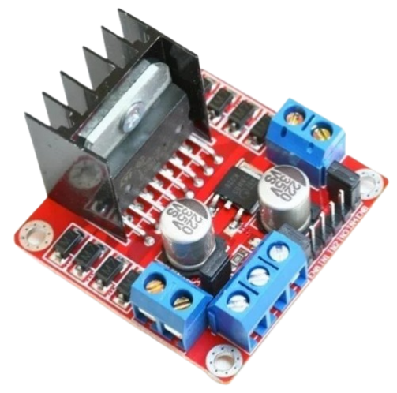
- **1x** Reservatório de ração 

- **1x** Caixa de montagem  
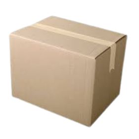
- **1x** Balança (Seu sensor de peso foi utilizado)
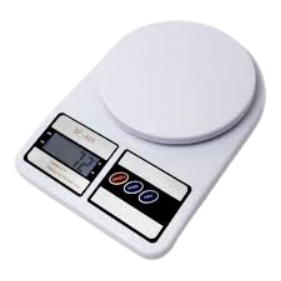
- **1x** Impressora 3D  

---

## Diagrama da Montagem (Fritzing)

- Arquivo Fritzing do projeto: `fritzing/fritzing.fzz`  
- Os componentes que foram importados separadamente se encontram na pasta "fritzing".

---

## Explicação do Diagrama

1. **Arduíno Mega**  
   - **Função**: unidade central de controle do projeto. É responsável por processar os dados da balança, receber comandos da interface web e controlar os motores.
   - **Conexões**: 
      - Alimentação via USB

2. **Servo motor (Agitador de ração)**  
   - **Função**: movimenta a ração dentro do reservatório, evitando que ela fique presa antes de ser liberada.
   - **Conexões**: 
      - Sinal: pino digital
      - VCC: 5V
      - GND: GND

3. **Motor DC (Liberação da ração)**  
   - **Função**: aciona o mecanismo responsável por liberar a ração pelo tubo de PVC.
   - **Conexões**: 
      - Terminais do motor conectados à ponte H

4. **Célula de Carga (Balança)**  
   - **Função**: mede o peso da ração liberada, permitindo que o sistema interrompa o processo ao atingir o valor configurado.
   - **Conexões**: 
      - Fios da célula conectados ao módulo HX711 (E+, E−, A+, A−)

5. **Módulo HX711**  
   - **Função**: amplifica e converte o sinal analógico da célula de carga em dados digitais compreensíveis pelo Arduino.
   - **Conexões**: 
      - DT (Data): pino digital do Arduino
      - SCK: pino digital do arduíno
      - VCC: 5V
      - GND: GND
      - Entradas conectadas à célula de carga

6. **Módulo Wi-Fi (ESP8266)**  
   - **Função**: permite a comunicação do Arduino com a rede Wi-Fi, possibilitando o controle do alimentador via navegador.
   - **Conexões**: 
      - TX: RX do arduíno
      - RX: TX do arduíno
      - VCC: 5V
      - GND: GND

7. **Fonte de Alimentação Externa**  
   - **Função**: fornece energia suficiente para os motores e servos, evitando sobrecarga no Arduino.

---

## Foto do Projeto Montado

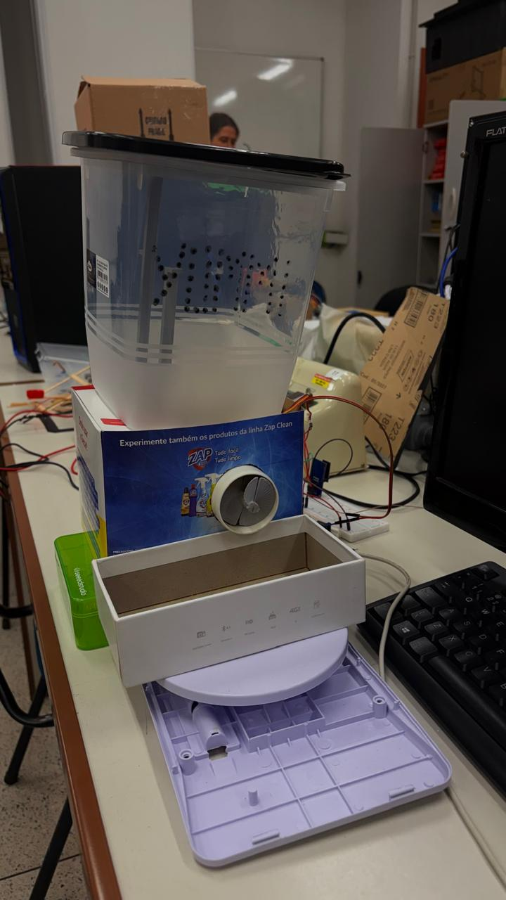

---

## Vídeo do Projeto em Funcionamento
 
Link direto do vídeo: `https://drive.google.com/file/d/1mnle7g3bbe9a2HnBpE-G1RTfhmxTSZ-H/view?usp=sharing`

---

## Problemas Encontrados no Processo de Montagem

- **Encaixe da rosca no cano PVC:** dificuldade ao fazer o encaixe perfeito da rosca no cano PVC. A conexão da rosca impressa 3d com o motor, e seu encaixe dentro do cano não funcionou bem, ela não rodava sempre com perfeição. Além disso, a fixação do motor foi uma tarefa difícil.
- **Alimentação:** devido à quantidade de componentes do projeto, somente a alimentação do arduíno não foi suficiente.
- **Balança:** realizar a abertura da balança, a calibração da célula de carga e conexão dos fios foi um pouco complicado.
- Em geral, enfrentamos mais dificuldades na parte física do projeto.

---

## Evolução do Projeto

### Etapas realizadas até a aula do dia 19/11:
- Abertura da balança: tentamos entender como a informação é passada pelos componentes da balança e vimos que seria necessário o uso de um módulo conversor para o sensor de peso (HX711).
- Solda dos fios que saem do sensor de peso da balança na placa HX711, e dos fios que saem da mesma placa para serem enviados para a placa Arduíno.
- Com a conexão do sensor de peso ao arduíno, realizamos a calibração da balança com um código.
- Conexão do servo ao projeto: esse servo controlará o agitador de ração. Produzimos um código inicial, o qual aguarda o sinal de botão para agitar a ração, até que um certo peso na balança é atingido. 

### Aula 25/11:
- Análise de motores possíveis para controlar a rosca que libera a ração. Escolhemos o Micro Motor DC N20 e tentamos conectá-lo à uma ponte H para dividir a alimentação. Contudo, tivemos problema com a fonte que utilizamos e resolvemos conectar o motor diretamente ao arduíno. Incluímos essa parte no código, ativando o motor depois que o servo do agitador para, até que o peso seja atingido.

### Aula 26/11:
- Iniciamos a lógica do Wi-Fi, entendendo o funcionamento do módulo ESP8266. Utilizamos um código teste para testarmos o módulo.

### Aula 03/12:
- Unimos o código da lógica do projeto com o código teste do Wi-Fi. Criamos funções com lógica de máquina de estado para o funcionamento do projeto. Começamos o html para o cliente realizar as requisições pela web. Em geral, está funcionando bem. Alguns problemas surgiram no meio do caminho e precisam ser solucionados.

### Aula 09/12:
- Começamos a montar a parte estrutural do projeto. Conectar os componentes, parafusar itens, etc.

### Aula 10/12:
- Tivemos problema com a peça que serve a ração e sua conexão com o motor. O motor não estava estruturalmente estável, o que fazia com que a peça travasse dentro do cano PVC. Passamos o dia tentando solucionar este problema.

### "Aula" 15/12:
- Com o problema da peça que serve a ração inicialmente solucionado, resolvemos problemas com o código, como html para requisição e configuração da tara da balança. Além disso, fizemos as atualizações necessárias no Fritizing do projeto. Ao iniciarmos a montagem do projeto, vimos que a energia fornecida pelo arduíno não seria suficiente, tendo em vista que o motor não estava funcionando. Com isso, foi necessário utilizar fontes de energia externas, como point H.

### "Aula" 15/12:
- Com os problemas estruturais e de software resolvidos, partimos para a montagem final do projeto.
---

## Referências

- Automatic Arduino Powered Pet Feeder: https://www.instructables.com/Automatic-Arduino-Powered-Pet-Feeder/

---

## Créditos

- Arthur Carvalho: ajuda na implementação do Wi-Fi
- Davi Greco: ajuda na solda de alguns componentes
- Milene: ajuda no mental e na parte estrutural